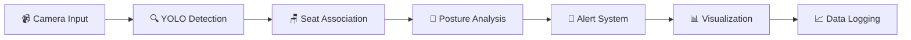

# 📚 Ai Powered Library Seat Monitoring System

[](https://python.org)
[](https://ultralytics.com)
[](https://opencv.org)
[](LICENSE)

> An intelligent computer vision system that automatically monitors library seat occupancy and student engagement using YOLOv8 and advanced computer vision techniques.

## ✨ Key Features

| Feature | Description |
|---------|-------------|
| 🪑 **Automatic Seat Detection** | Dynamically detects and maps all chairs in real-time |
| 🧍‍♂️ **Occupancy Detection** | Real-time tracking of empty/occupied seats with high accuracy |
| 🧠 **Posture Analysis** | Detects focused vs distracted behavior using advanced pose estimation |
| 🔔 **Smart Reminders** | Gentle alerts for inactivity to encourage productivity |
| 📊 **Analytics Dashboard** | Real-time utilization metrics and interactive heatmaps |
| 📈 **Data Logging** | Comprehensive analytics and detailed reporting |
| 🎯 **Performance Monitoring** | Real-time FPS and accuracy tracking |

## 🚀 Quick Start

Get up and running in minutes with these simple steps:

### 1️⃣ **Environment Setup**
```bash
# Create and activate virtual environment with Python 3.9
python3.9 -m venv venv
source venv/bin/activate  # On Windows: venv\Scripts\activate
```

### 2️⃣ **Install Dependencies**
```bash
pip install -r requirements.txt
```

### 3️⃣ **Test the System**
```bash
python test_system.py
```

### 4️⃣ **Launch Monitoring**
```bash
python main.py
```

> **💡 Pro Tip**: Run `python main.py --help` to see all available command-line options!

## 📦 Installation

### 🔧 Manual Installation

```bash
# Create virtual environment with Python 3.9
python3.9 -m venv venv
source venv/bin/activate  # On Windows: venv\Scripts\activate

# Install dependencies
pip install -r requirements.txt

# Download YOLO model (automatic on first run)
python -c "from ultralytics import YOLO; YOLO('yolov8n.pt')"

# Create directories
mkdir -p logs exports screenshots heatmaps
```

### 💻 System Requirements

| Component | Requirement | Notes |
|-----------|-------------|-------|
| **Python** | 3.9+ | Recommended for MediaPipe compatibility |
| **RAM** | 4GB+ | Minimum for smooth operation |
| **GPU** | Optional | Recommended for optimal performance |
| **Camera** | OpenCV compatible | USB webcam or IP camera |
| **OS** | Windows/macOS/Linux | Cross-platform support |

> **⚠️ Important**: Python 3.9 is recommended as MediaPipe has compatibility issues with Python 3.13.

## 🎮 Usage

### 🏃‍♂️ Basic Usage

```bash
# Run with default settings
python main.py

# Run with custom camera
python main.py --camera 1

# Run without dashboard
python main.py --no-dashboard

# Run without alerts
python main.py --no-alerts

# Run without data logging
python main.py --no-logging
```

### ⚙️ Advanced Usage

```bash
# Custom confidence threshold
python main.py --confidence 0.7

# Custom IoU threshold
python main.py --iou 0.4

# Use custom YOLO model
python main.py --model path/to/model.pt
```

### ⌨️ Keyboard Controls

| Key | Action |
|-----|--------|
| `q` or `ESC` | Quit the system |
| `s` | Save screenshot |
| `h` | Save heatmap |
| `e` | Export data to CSV |

## ⚙️ Configuration

The system can be configured through `config.py` or by creating a `config.json` file:

```json
{
  "detection": {
    "confidence_threshold": 0.5,
    "iou_threshold": 0.3
  },
  "posture": {
    "inactivity_threshold": 30.0,
    "head_tilt_threshold": 30.0
  },
  "alert": {
    "enable_audio": true,
    "alert_cooldown": 60.0
  }
}
```

## 📊 Performance Targets

| Metric | Target | Description |
|--------|--------|-------------|
| **Detection FPS** | ≥ 15 FPS | Real-time processing capability |
| **Occupancy Accuracy** | ≥ 90% | Reliable seat occupancy detection |
| **Max Persons per Camera** | 40-50 | Scalability for large spaces |
| **False Slack Alerts** | ≤ 10% | Minimize false positive alerts |
| **Processing Time** | ≤ 200ms per frame | Efficient real-time processing |

## 🏗️ Architecture



## 📁 File Structure

```
library productivity/
├── 📄 main.py                 # Main application entry point
├── 🔍 detection.py           # YOLO detection system
├── 🧠 posture_analysis.py    # Posture analysis system
├── 🔔 alert_system.py       # Alert and notification system
├── 📊 visualization.py       # Real-time visualization
├── 📈 data_logging.py       # Data logging and analytics
├── ⚙️ config.py             # Configuration management
├── 🧪 test_system.py        # System testing
├── 🛠️ setup.py              # Setup script
├── 📋 requirements.txt      # Dependencies
├── 🤖 yolov8n.pt           # YOLO model weights
├── 📁 venv/                # Virtual environment
├── 📁 logs/                # Log files
├── 📁 exports/             # Data exports
├── 📁 screenshots/         # Screenshots
├── 📁 heatmaps/           # Heatmap images
└── 📖 README.md            # This file
```

## 🔧 Troubleshooting

### 🚨 Common Issues

| Issue | Solution |
|-------|----------|
| **Camera not detected** | Check camera permissions and try different camera indices |
| **Low FPS** | Reduce frame resolution or disable dashboard |
| **Detection errors** | Adjust confidence threshold |
| **Audio alerts not working** | Check pygame installation |
| **Import errors** | Make sure virtual environment is activated |
| **MediaPipe issues** | The system uses alternative posture analysis methods |
| **Permission errors** | Run with appropriate camera permissions |

### 🧪 Testing

Run the test suite to verify system functionality:

```bash
# Make sure virtual environment is activated
source venv/bin/activate  # On Windows: venv\Scripts\activate

# Run tests
python test_system.py
```

### 🐍 Virtual Environment Management

```bash
# Activate virtual environment
source venv/bin/activate  # On Windows: venv\Scripts\activate

# Deactivate virtual environment
deactivate

# Remove virtual environment (if needed)
rm -rf venv
```

### 📁 Logs and Data

| Directory | Purpose |
|-----------|---------|
| `logs/` | System log files |
| `exports/` | Data exports and reports |
| `screenshots/` | Captured screenshots |
| `heatmaps/` | Generated heatmap images |
| `library_monitoring.db` | SQLite database |

## 🔒 Privacy and Ethics

| Principle | Implementation |
|-----------|----------------|
| **No Face Recognition** | No personal identification or facial recognition |
| **Posture Focus** | Only analyzes posture and occupancy patterns |
| **Data Anonymization** | All collected data is anonymized |
| **Privacy Respect** | Maintains respectful study environment |

---

## 🤝 Contributing

We welcome contributions! Please feel free to submit issues and pull requests.

[⬆ Back to Top](#-library-seat-monitoring-system)

</div>
